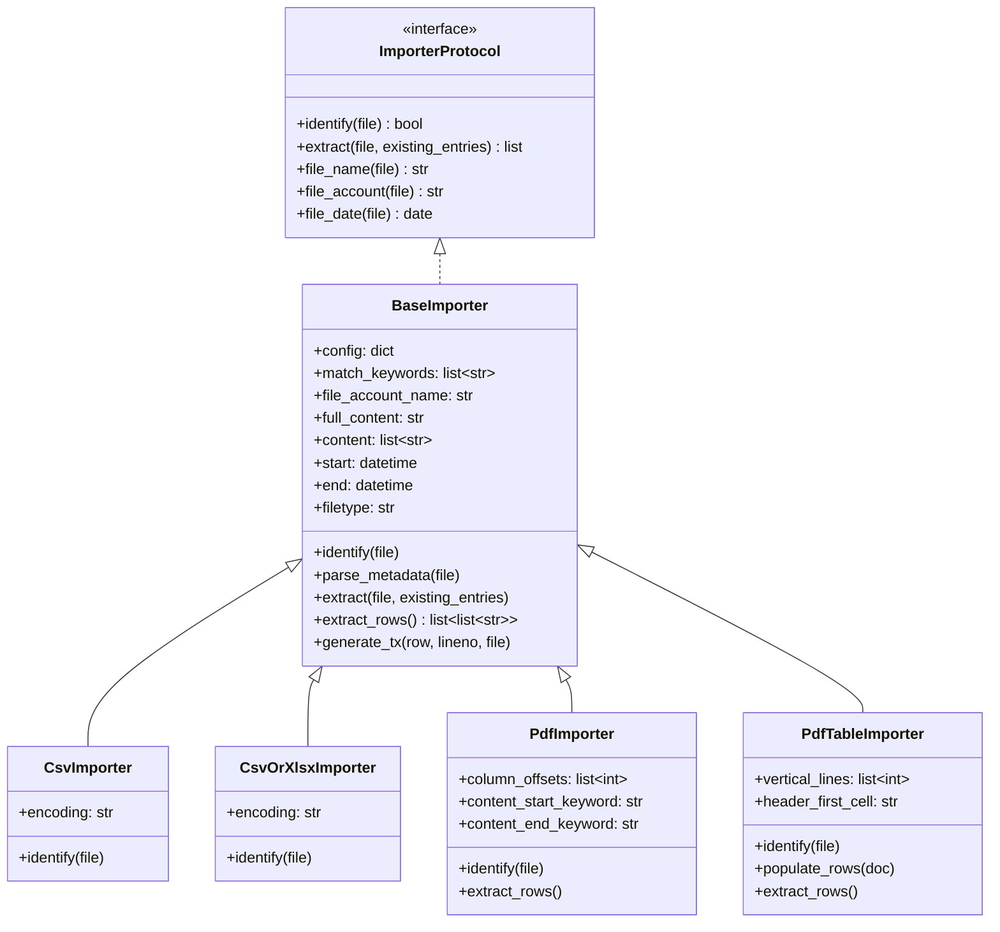
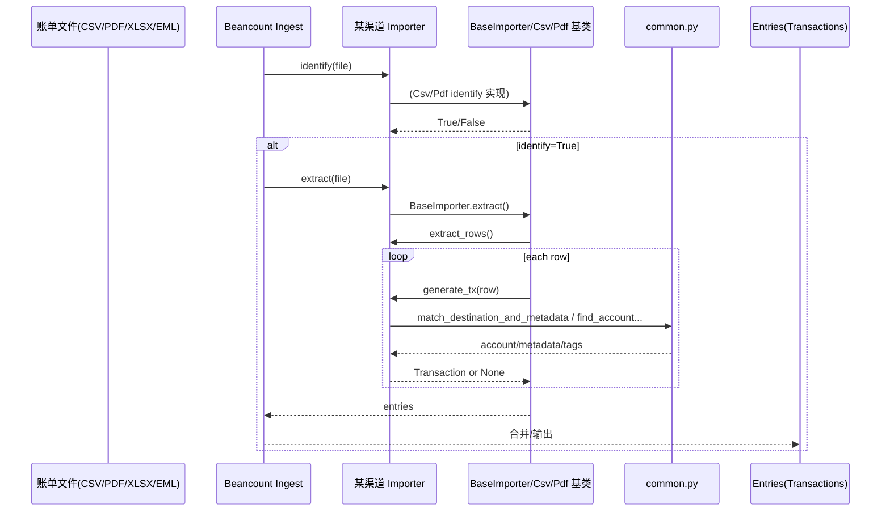
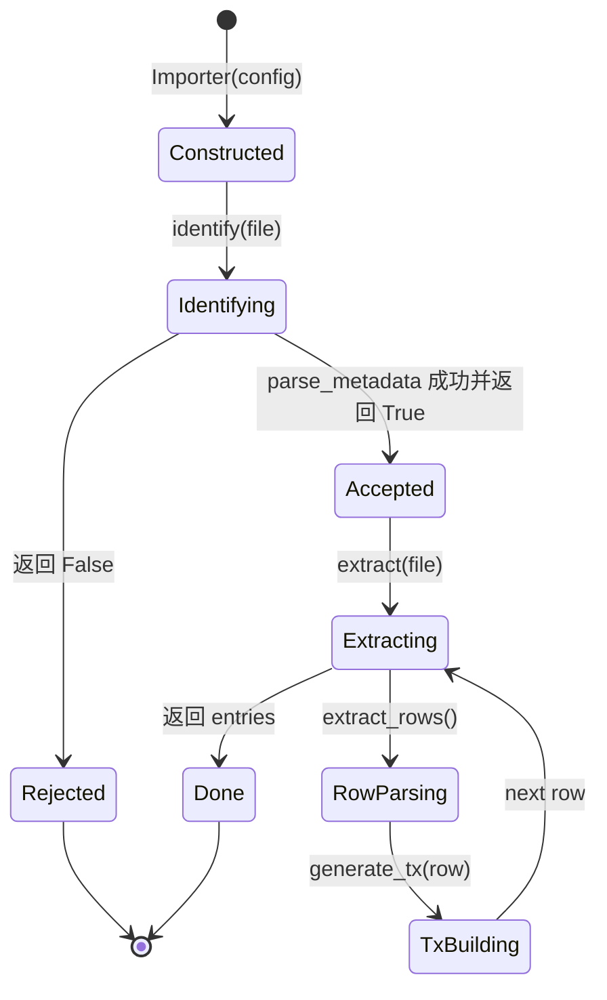

# 1. 架构概览与核心设计（china_bean_importers）

> 基于当前仓库 `/media/code/tools/china_bean_importers` 的源码与文档（README、pyproject、china_bean_importers/common.py、importer.py、dedup.py、import_config.py、config.example.py）。

## 1.1 技术栈与架构概览

### 主要技术栈

- **语言/运行时**：Python 3.9+（`pyproject.toml`：`>=3.9,<4`）
- **打包/构建**：Flit（`flit-core==3.12.0`）
- **核心依赖**：
  - `beancount < 3`：作为目标账本系统与 ingest 接口（ImporterProtocol、Entry/Transaction 等）。
  - `pymupdf`（`fitz`）：用于解析 PDF（含加密 PDF 解密尝试）。
  - `BeautifulSoup4`：用于解析 HTML/邮件等文本（在部分 importer 中通常会用到；本阶段未展开到各子 importer 文件）。
- **可选依赖（运行期按需）**：`pandas`、`openpyxl`（仅在 `CsvOrXlsxImporter` 解析 `.xlsx` 时动态 import）。

### 架构形态

- **单体库（library）+ 插件式适配器（importer plugins）**：
  - 核心提供一组可复用的 BaseImporter / CsvImporter / PdfImporter 等“框架基类”。
  - 各数据源（微信、支付宝、各家银行等）在子包中实现具体 Importer，作为“适配器”。
- **典型数据流**：
  - 输入：用户导出的账单文件（CSV/TXT/PDF/EML/可能 XLSX）。
  - 输出：Beancount ingest 所需的 entries（以 Transaction 为主），供用户导入账本。
- **配置驱动**：
  - `config.py`（由 `config.example.py` 复制后编辑）提供账户映射、分类映射、PDF 密码、匹配规则等。
  - `import_config.py` 是 beancount ingest 用的入口配置（`CONFIG=[Importer(...), ...]`）。

## 1.2 核心架构设计原则与设计模式

### 设计原则

- **关注点分离（Separation of Concerns）**
  - “文件识别/读取/解析” 与 “账务语义映射（账户、标签、元数据）” 分离：
    - `importer.py` 负责识别与抽取表格行、生成交易入口的骨架。
    - `common.py` 提供通用匹配与辅助函数（账号末四位识别、账户匹配、detail mapping 等）。
- **高内聚低耦合**
  - 各渠道 Importer 只需实现少量钩子（identify/parse_metadata/extract_rows/generate_tx），共享框架逻辑。
- **配置优于硬编码**
  - 账户映射、分类映射、黑白名单、明细匹配规则（`detail_mappings`）等都以配置形式存在。
- **渐进式增强 / 容错**
  - `CsvOrXlsxImporter` 对 xlsx 解析依赖缺失时打印 WARNING 并返回 False，避免影响整体流程。
  - `open_pdf` 尝试多密码解密，失败则识别失败。

### 设计模式（在当前代码中可观察到的）

- **模板方法（Template Method）**
  - `BaseImporter.extract()` 固化了“遍历行 -> generate_tx -> 过滤 None”的流程；
  - 子类/具体 Importer 通过实现 `extract_rows()` 和 `generate_tx()` 来定制。
- **策略模式（Strategy, by configuration）**
  - `BillDetailMapping` + `match_destination_and_metadata()`：通过配置列表选择/合并匹配结果；
  - 黑/白名单（`in_blacklist`）对不同渠道/卡账单过滤策略可配置。
- **适配器模式（Adapter）**
  - 每个渠道的 Importer 将其账单格式适配为统一的 Beancount Transaction/Posting 结构。

> 注：严格意义的“工厂模式”等并不明显；插件式导入更接近“注册/组合”而非显式工厂。

## 1.3 模块划分与主要组件交互

### 模块划分依据

- **按职责分层**
  1. 框架层：定义 Importer 基类与通用抽取流程（`china_bean_importers/importer.py`）。
  2. 通用工具层：通用匹配、PDF 打开/解密、规则匹配（`china_bean_importers/common.py`）。
  3. 业务适配层：各渠道 Importer（例如 `wechat/`, `alipay_mobile/`, `boc_credit_card/` 等目录）。
  4. 辅助后处理：去重/标记等（`china_bean_importers/dedup.py`）。
  5. 使用者集成层：用户侧 `config.py` + `import_config.py`（导入脚本）。

### 核心组件与输入输出

#### A) `china_bean_importers/importer.py`

- **输入**：beancount ingest 提供的 `file`（具备 `.name`），以及用户传入的 `config: dict`。
- **输出**：`extract()` 返回 entries 列表（Transaction 等）。
- **核心 API / 扩展点**：
  - `identify(file) -> bool`：判断该文件是否属于该 Importer。
  - `parse_metadata(file)`：解析文件元信息（起止日期、账户等），通常会设置：
    - `self.start/self.end: datetime`
    - `self.file_account_name: str`
  - `extract_rows() -> list[list[str]]`：输出标准化行数据。
  - `generate_tx(row, lineno, file) -> Transaction | None`：将行转换为交易。
- **内置基类**：
  - `CsvImporter`：读取文本、按关键字匹配、切分 content 行。
  - `CsvOrXlsxImporter`：支持 `.csv` 和 `.xlsx`（xlsx 通过 pandas 读取后转 csv）。
  - `PdfImporter`：基于 PyMuPDF words + 关键字识别；支持按列偏移进行“表格化行抽取”。
  - `PdfTableImporter`：使用 `page.find_tables()` 直接提取表格。

#### B) `china_bean_importers/common.py`

- **输入**：配置（config dict）、描述/对手等字段、卡号末四位等。
- **输出**：账户/元数据/标签，或解析结果（货币 code、卡号末四位等）。
- **核心对象**：
  - `BillDetailMapping(NamedTuple)`：
    - 关键词匹配 narration/payee
    - 返回：`(destination_account, additional_metadata, additional_tags, priority)`
  - `match_destination_and_metadata(config, desc, payee)`：遍历 `config["detail_mappings"]` 合并匹配结果；按优先级/层级处理冲突。
  - `open_pdf(config, name)`：解密 PDF（尝试 `config["pdf_passwords"]`）。
  - `find_account_by_card_number(config, card_number)`：按末四位映射到账户路径。
  - `unknown_account(config, expense)`：兜底账户。
  - `in_blacklist(config, narration)`：结合白名单优先逻辑过滤。

#### C) `china_bean_importers/dedup.py`

- **作用**：对一类特定场景（微信亲属卡 / 财付通）做“去重标记/标签修正”。
- **输入**：`new_entries_list`（通常是 beancount ingest 管道中多个 importer 的输出聚合）与 `existing_entries`。
- **输出**：修改后的 entries list：
  - 对应交易会被加上 `DUPLICATE_META=True` 或追加 tags、重写 narration、替换某些 posting 的 account。

#### D) 用户集成层：`config.py` / `import_config.py`

- `config.py`：用户侧全局配置，包含：
  - 各 importer 的账户/分类映射
  - `card_accounts`、`pdf_passwords`
  - `unknown_*_account`
  - `detail_mappings: list[BDM]`
- `import_config.py`：beancount ingest 入口配置，声明要启用的 Importer 列表。

### 主要组件交互方式

1. 用户导出账单文件，放到 ingest 可扫描目录。
2. beancount ingest 对每个文件依次调用每个 Importer 的 `identify()`：
   - Csv/Pdf 等基类实现了通用识别逻辑：关键字匹配 + 解析元信息。
3. 识别成功后调用 `extract()`：
   - `extract()` 调用 `extract_rows()`（具体 importer 实现）得到行。
   - 对每行调用 `generate_tx()` 生成交易。
4. `generate_tx()` 内部通常会调用 `common.py` 的辅助函数：
   - 账户匹配（卡号末四位、detail mapping、unknown fallback）
   - 标签/元数据补充
5. （可选）将多个 importer 的结果送入 `dedup.find_wechat_family()` 等后处理逻辑。

## 1.4 架构图示（Mermaid）

### 1) 框架图（分层与插件结构）

```mermaid
flowchart TB
  subgraph UserSide[用户项目侧]
    U1[config.py
(用户自定义映射/规则)]
    U2[import_config.py
(beancount ingest 入口 CONFIG)]
  end

  subgraph Package[china_bean_importers 包]
    C1[common.py
匹配/解析/工具函数]
    F1[importer.py
BaseImporter + Csv/Pdf 基类]
    D1[dedup.py
后处理/去重标记]

    subgraph Plugins[各渠道 Importer 子包]
      P1[wechat.Importer]
      P2[alipay_mobile.Importer]
      P3[boc_credit_card.Importer]
      Pn[...]
    end
  end

  subgraph Beancount[beancount ingest]
    B1[ImporterProtocol]
    B2[Ingest Pipeline]
    B3[Entries/Transactions]
  end

  U2 --> B2
  U1 --> P1
  U1 --> P2
  U1 --> P3

  F1 --> P1
  F1 --> P2
  F1 --> P3

  P1 --> C1
  P2 --> C1
  P3 --> C1

  B2 -->|identify/extract| P1
  B2 -->|identify/extract| P2
  B2 -->|identify/extract| P3

  P1 --> B3
  P2 --> B3
  P3 --> B3

  B3 --> D1
```

### 2) 类关系图（Importer 基类族）



### 3) 数据流图（从账单文件到 Transaction）



### 4) 生命周期图（Importer 实例生命周期）


